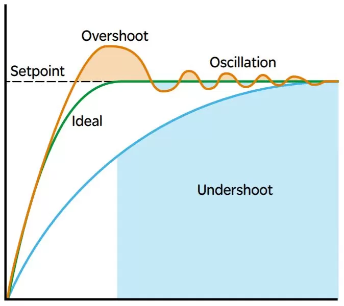

## PID Components:

- Proportional (P): Corrects error proportionally.
- Integral (I): Fixes accumulated error over time.
- Derivative (D): Prevents overshooting by considering error rate.

#### Industrial Applications:

- Automated Dispensing Systems: Controls flow for accurate dispensing.
- Conveyor Belt Speed: Regulates speed for consistent flow.
- Robot Arm Positioning: Ensures precise and stable movement.

## PID Components

##### Proportional (P) Calculation

- Current Error
- Simplified: "The more off-target we are now, the harder we try to correct it."
- P = Kp \* error
- Here, Kp is the proportional gain, a constant.
- error is the difference between the setpoint (desired value) and the current value (measured value).
- Adjusts the output proportionally to the current error (the difference between the desired value and the actual value). If the error is large, the correction is large.

##### Integral (I) Calculation

- Past Error; prevents undershoot
- Simplified: "If we've been off-target for a while, increase the effort to catch up."

- I = `integral_previous` + (Ki \* error)
- Ki is the integral gain.
- `integral_previous` is the accumulated integral value from the previous step.
- This calculation adds the current error (multiplied by the integral gain) to the accumulated integral.
- Addresses accumulated errors over time, correcting long-term, persistent errors that the Proportional component might miss.

##### Derivative (D) Calculation

- Future Error
- Simplified: "If we're quickly approaching the target, start slowing down to avoid overshooting."
- D = Kd \* (error - error_previous)
- Kd is the derivative gain.
  error_previous is the error from the previous step.
- This calculates the change in error and multiplies it by the derivative gain.
- Reacts to the rate of change of the error. It provides a damping effect, which reduces oscillations and overshoot.

##### Final PID Output

output = P + I + D

## PID Snippet

```
let integral_previous = 0;
let error_previous = 0;

for (let step = 0; step < 100; step++) {
// Current = Previous Output + noise => Passed from Sim Class
const error = setpoint - current_response;

    // Proportional
    const P = Kp * error;

    // Integral
    const I = I_previous + (Ki * error);
    `integral_previous` = I; // Update for next iteration

    // Derivative
    const D = Kd * (error - error_previous);
    error_previous = error; // Update for next iteration

    // PID Output
    const output = P + I + D;

    // Use the output to adjust your system

}
```


